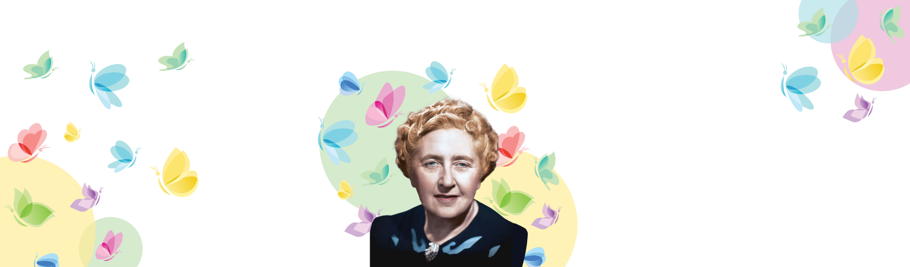
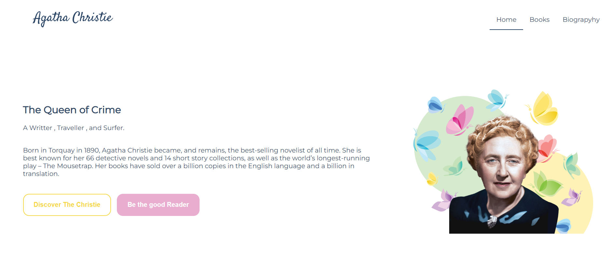
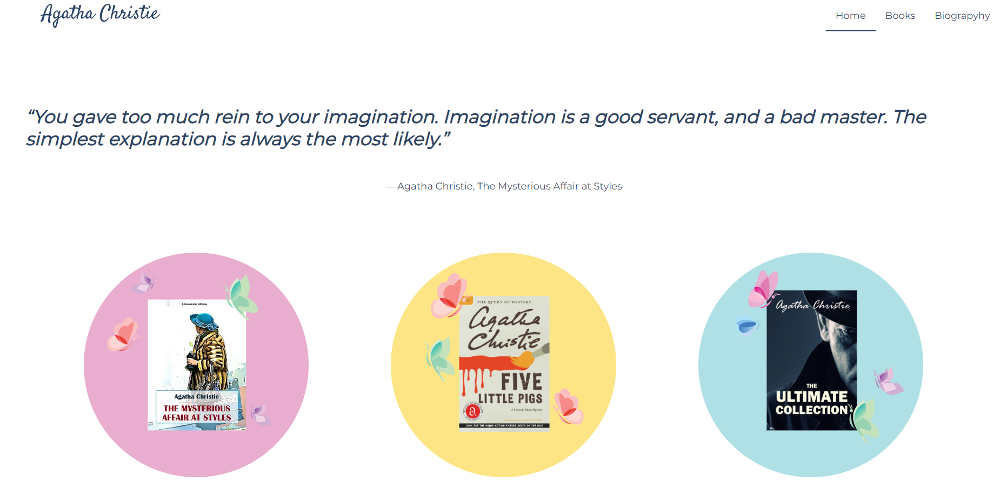
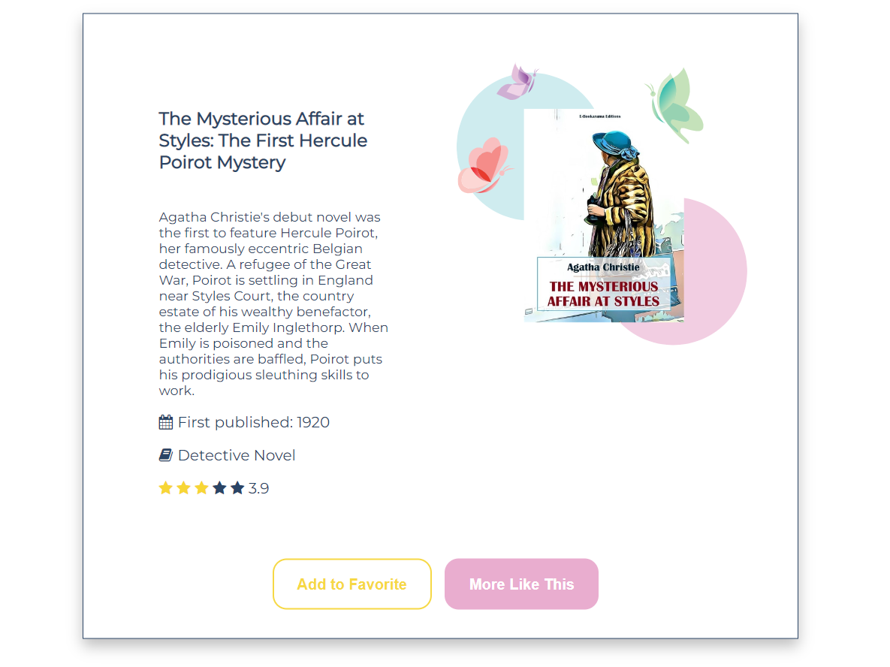
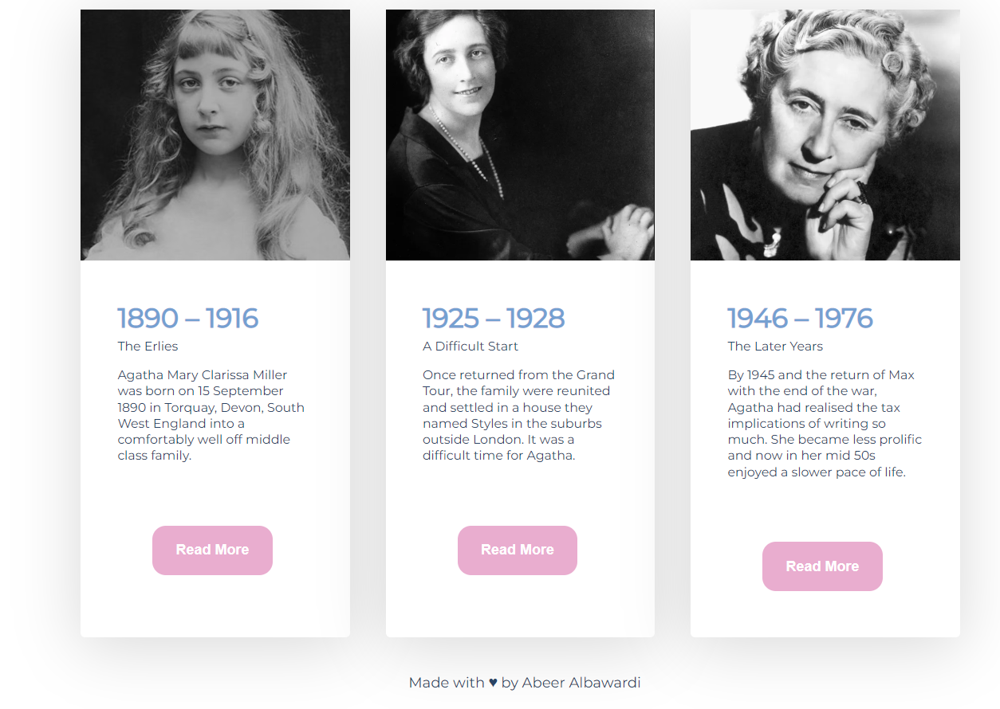

# Agatha Christie | Personal Blog (HTML,CSS)
## Table of Contents
- [Agatha Christie | Web Application](#Agatha Christie-web-application)
  - [Table of Contents](#table-of-contents)
    - [Project Description](#project-description)
    - [Mood Board](#mood-board)
    - [Future Goals](#future-goals)
    - [Final result](#final-result)
    - [References](#references)
### Project Description
***
Agatha Christie is a frontend web app, as a requirement for the Udacity Nano Degree Program. designed and built from scratch with HTML and CSS, layout structure is made with CSS grid and flexbox.

## Final result
***

## Final result
***

## References
***
- [Flex Box](https://css-tricks.com/snippets/css/a-guide-to-flexbox/)
- [Grid](https://css-tricks.com/snippets/css/complete-guide-grid/)

